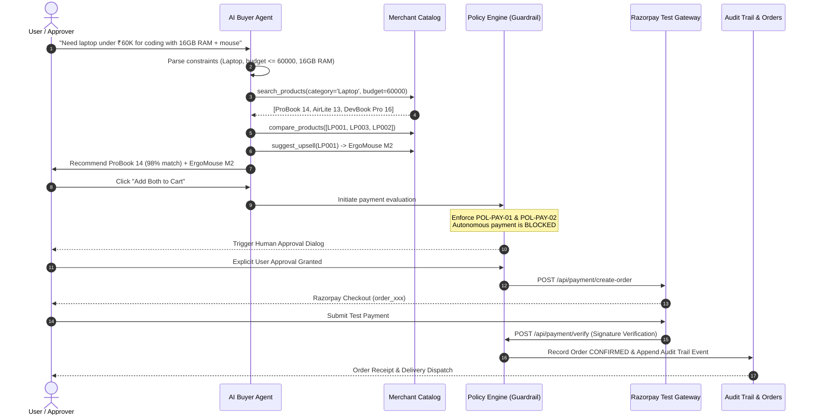

# BuyFlow AI — Autonomous Agentic Commerce & Guarded Payments
> **Built for the Razorpay AI Buildathon — Track 01: AI Growth & Agentic Commerce**

BuyFlow AI turns merchant catalogs into machine-readable knowledge graphs and enables autonomous AI Buyers to complete end-to-end purchasing journeys—from natural language request to verified Razorpay payment—while enforcing zero-trust financial guardrails.

---

## ⚡ The 2-Minute Hackathon Demo

Execute the full flow in under 2 minutes:

1. **AI Buyer Search**:
   - Query: *"I need a laptop under ₹60,000 for coding with at least 16GB RAM. Also suggest a mouse."*
   - Or click **`⚡ Run 2-Min Demo`** in the top navigation bar.
2. **AI Reasoning & Upsell**:
   - The AI extracts constraints (`category: Laptop`, `budget: ₹60,000`, `RAM: 16GB`, `use_case: coding`).
   - Evaluates 13 catalog products and recommends **ProBook 14** (₹54,999) with a 98% match score.
   - Automatically pairs it with the **ErgoMouse M2** (₹1,299) as contextual cross-sell.
3. **Cart Assembly & Policy Intercept**:
   - Items staged into cart (Total + 18% GST = ₹66,432).
   - **Policy Engine intercepts**: Blocks autonomous payment execution under `Rule POL-PAY-01` & `Rule POL-PAY-02` (High value > ₹50,000).
4. **Explicit Human Approval**:
   - Human reviews itemized breakdown and clicks **`[Approve Payment]`**.
5. **Razorpay Test Payment**:
   - Backend calls Razorpay `/orders` API and returns order ID.
   - Test payment completes via Test Card, UPI (`success@razorpay`), or NetBanking.
   - Server cryptographically verifies HMAC SHA256 signature.
6. **Graceful Failure Handling Simulation**:
   - Toggle **`Fail Sim: ON`** in top bar.
   - Run checkout again or select UPI `failure@razorpay`.
   - Payment fails cleanly: system reports diagnostic reason, marks status as `FAILED`, and strictly avoids blind auto-retries.
7. **Verifiable Telemetry**:
   - Inspect the **Audit Trail** and **AI Decisions** tabs for immutable logs and transparent reasoning trees.

---

## 🏗️ Architectural Flow



---

## 🛡️ Financial Guardrail Policies

| Policy ID | Action | Condition | Resolution |
|---|---|---|---|
| `POL-CAT-01` | `search_products`, `compare_products` | Any | **ALLOWED** (Autonomous) |
| `POL-CART-01` | `add_to_cart` | Valid catalog item | **ALLOWED** (Autonomous) |
| `POL-PAY-01` | `initiate_payment` | Without user approval | **BLOCKED / GATED** (Requires User Approval) |
| `POL-PAY-02` | `initiate_payment` | Amount >= ₹50,000 | **EXPLICIT APPROVAL REQUIRED** |
| `POL-REF-01` | `refund` | AI Agent | **PERMANENTLY FORBIDDEN** (Merchant Admin Only) |
| `POL-RETRY-01` | `payment_failure` | Gateway rejection | **HALT & LOG** (Zero blind auto-retries) |

---

## 🌐 API Reference

### Catalog & Discovery
- `GET /api/products` — List all AI-indexed catalog items (filters: `category`, `search`).
- `POST /api/products` — Create / update product with AI schema attributes.

### Agentic Intelligence
- `POST /api/agent/search` — Natural language query processor, constraint extractor, comparator, and upsell engine.
- `POST /api/agent/recommend` — Recommend contextual peripherals for given base SKU.

### Cart & Checkout
- `GET /api/cart/:id` — Retrieve active cart.
- `POST /api/cart` — Add line item with attribution tag (`ai_buyer` vs `user`).
- `DELETE /api/cart/:cartId/items/:productId` — Remove line item.

### Guardrails & Payments
- `POST /api/payment/policy-check` — Evaluates Policy Engine guardrails against cart parameters.
- `POST /api/payment/create-order` — Creates Razorpay order (or authenticated mock order).
- `POST /api/payment/verify` — Server-side HMAC SHA256 payment signature verification.

### Telemetry & Audit
- `GET /api/orders` — List confirmed and failed orders with transaction references.
- `GET /api/audit` — Immutable chronologically sorted event stream.
- `GET /api/decisions` — Explainable AI decision trees with confidence scores.
- `GET /api/analytics` — Real-time conversion funnel and merchant revenue metrics.
- `POST /api/demo/run-scenario` — 1-Click test execution for fast 2-minute judge reviews.

---

## ⚙️ Environment Configuration

Set credentials in `.env`:

```env
# Optional: Live Razorpay Test Mode keys (defaults to built-in Test Mode simulator)
RAZORPAY_KEY_ID=rzp_test_YourKeyHere
RAZORPAY_KEY_SECRET=YourSecretHere

# Set to true to force offline test simulation
MOCK_PAYMENT=true

# Optional: Gemini API Key for dynamic natural language explanations
GEMINI_API_KEY=
```

---

## 🚀 Running the Project

```bash
# Install dependencies
npm install

# Start local server (port 3000)
npm run dev

# Compile production bundle
npm run build

# Start production server
npm run start
```
